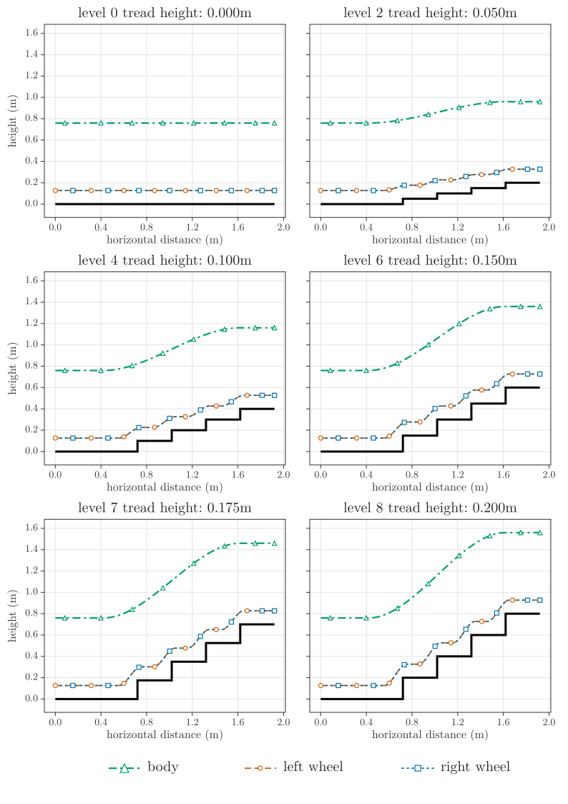
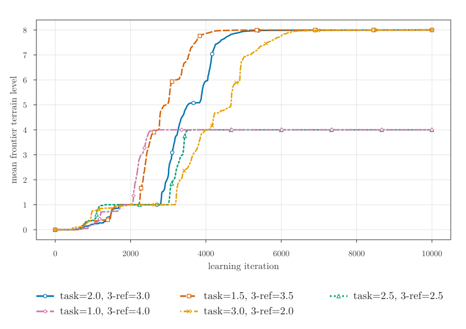
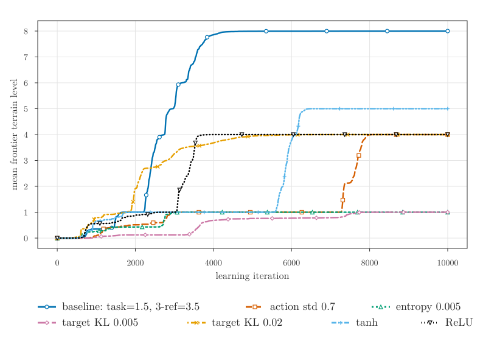

# Reference-Guided Legged-Wheel Locomotion on Stairs

Supplementary material for a master thesis on reference-guided Proximal Policy Optimization (PPO) for simulated stair climbing with a legged-wheel robot.

The project studies whether a policy can use predefined body and wheel reference trajectories to learn stable stair traversal in Isaac Lab. The page focuses on rendered evaluation videos and key figures. The thesis PDF is intentionally not included here.

## Representative Evaluation Videos

The videos below show deterministic play evaluations from selected trained policies.

### Reward balance: task=1.5, 3-ref=3.5

Best curriculum progression in the reward-weight sensitivity study.

<video src="assets/videos/stair_difficulty_sweep_w_task1p5_ref3p5.mp4" controls width="720"></video>

[Open video file](assets/videos/stair_difficulty_sweep_w_task1p5_ref3p5.mp4)

### tanh activation layer example

Variant that stalled at the 5th difficulty level. It could not learn behavior enabling it to climb step heights taller than the wheel radius.

<video src="assets/videos/stair_difficulty_sweep_ppo_activation_tanh_task1p5_ref3p5.mp4" controls width="720"></video>

[Open video file](assets/videos/stair_difficulty_sweep_ppo_activation_tanh_task1p5_ref3p5.mp4)

## Additional Evaluation Videos

Further deterministic play evaluations from the reward-weight and PPO hyperparameter studies.

### Reward-weight variants

#### task=1.0, 3-ref=4.0

<video src="assets/videos/stair_difficulty_sweep_w_task1p0_ref4p0.mp4" controls width="720"></video>

[Open video file](assets/videos/stair_difficulty_sweep_w_task1p0_ref4p0.mp4)

#### task=2.0, 3-ref=3.0

<video src="assets/videos/stair_difficulty_sweep_w_task2p0_ref3p0.mp4" controls width="720"></video>

[Open video file](assets/videos/stair_difficulty_sweep_w_task2p0_ref3p0.mp4)

#### task=2.5, 3-ref=2.5

<video src="assets/videos/stair_difficulty_sweep_w_task2p5_ref2p5.mp4" controls width="720"></video>

[Open video file](assets/videos/stair_difficulty_sweep_w_task2p5_ref2p5.mp4)

#### task=3.0, 3-ref=2.0

<video src="assets/videos/stair_difficulty_sweep_w_task3p0_ref2p0.mp4" controls width="720"></video>

[Open video file](assets/videos/stair_difficulty_sweep_w_task3p0_ref2p0.mp4)

### PPO hyperparameter variants

These variants use the `task=1.5, 3-ref=3.5` reward balance shown above as the comparison baseline. The highlighted `tanh` variant is shown in the representative videos above.

#### ReLU activation

<video src="assets/videos/stair_difficulty_sweep_ppo_activation_relu_task1p5_ref3p5.mp4" controls width="720"></video>

[Open video file](assets/videos/stair_difficulty_sweep_ppo_activation_relu_task1p5_ref3p5.mp4)

#### Entropy coefficient: 0.005

<video src="assets/videos/stair_difficulty_sweep_ppo_lower_entropy_ent5e3_task1p5_ref3p5.mp4" controls width="720"></video>

[Open video file](assets/videos/stair_difficulty_sweep_ppo_lower_entropy_ent5e3_task1p5_ref3p5.mp4)

#### Target KL: 0.005

<video src="assets/videos/stair_difficulty_sweep_ppo_lower_kl5e3_task1p5_ref3p5.mp4" controls width="720"></video>

[Open video file](assets/videos/stair_difficulty_sweep_ppo_lower_kl5e3_task1p5_ref3p5.mp4)

#### Target KL: 0.02

<video src="assets/videos/stair_difficulty_sweep_ppo_higher_kl2e2_task1p5_ref3p5.mp4" controls width="720"></video>

[Open video file](assets/videos/stair_difficulty_sweep_ppo_higher_kl2e2_task1p5_ref3p5.mp4)

#### Noise standard deviation: 0.7

<video src="assets/videos/stair_difficulty_sweep_ppo_lower_noise_std0p7_task1p5_ref3p5.mp4" controls width="720"></video>

[Open video file](assets/videos/stair_difficulty_sweep_ppo_lower_noise_std0p7_task1p5_ref3p5.mp4)

## Key Figures

### Three-reference trajectory bank

### Reward-weight sensitivity study

### PPO hyperparameter sensitivity study

## Scope

This repository is a supplementary project page. It is intended to make the qualitative locomotion behavior easier to inspect alongside the numerical evaluation reported in the thesis.
